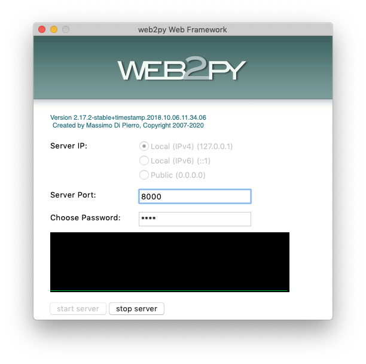
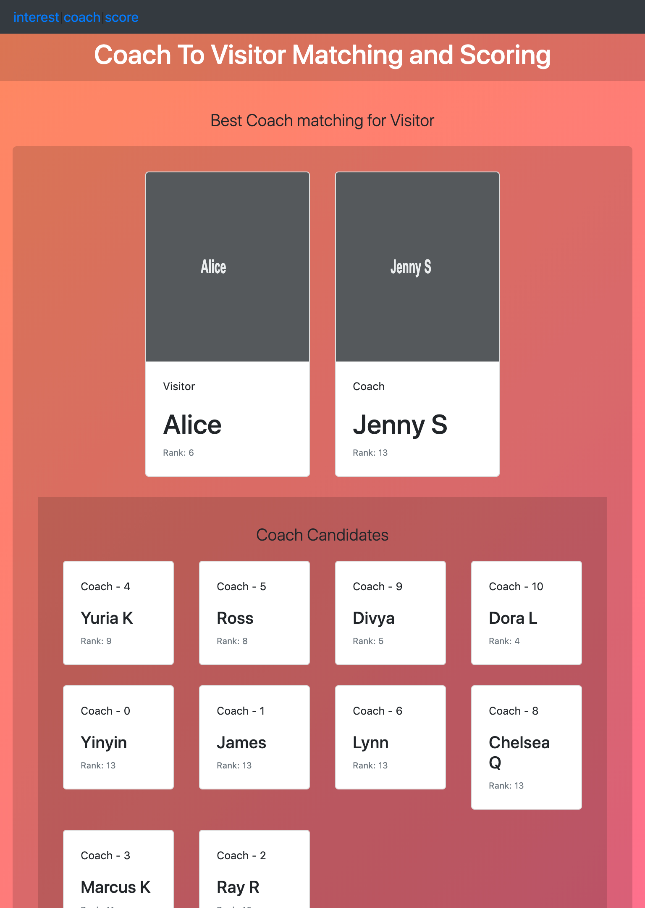
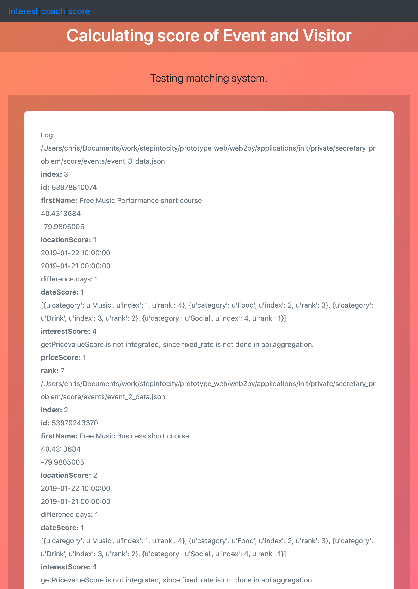
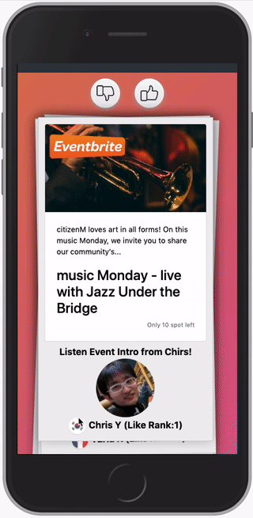

# Event Matching Applicaiton

This is an application that matches events from Meetup or Eventbrite with two human groups - Coach who introduces events(in their interest) and Visitor who want to go specific event for their entertainment.


<i>Main UI - Matching result of Events, Coach and Visitor</i>

## Installation
### 1. Checkout web2py
Check out [web2py](https://github.com/upperbrain/web2py)
```
$ git clone https://github.com/upperbrain/web2py.git web2py
$ cd applications/init
```
### 2. Checkout matching-secretary-problem
Check out [core codes](https://github.com/upperbrain/matching-secretary-problem)
```
$ pwd
/web2py/applications/init
$ git clone https://github.com/upperbrain/matching-secretary-problem.git .
```
### 3. Run and start web2py server
From another terminal screen run and start web2py server.
```
$ pwd
/web2py
$ python web2py.py
```
Once you start web2py server, the app will be loaded on your web browser.


## Matching
The matching logic is based on the [Secretary problem](https://en.wikipedia.org/wiki/Secretary_problem)
### Problem Description
- Hire the best secretary out of {\displaystyle n}n rankable applicants for a position
- The applicants are interviewed one by one in random order.
- A decision about each particular applicant is to be made immediately after the interview.
- Once rejected, an applicant cannot be recalled.
- During the interview, the administrator gains information sufficient to rank the applicant among all applicants interviewed so far.
- The administrator is unaware of the quality of yet unseen applicants.

The Secretary Problem is already resolved, and it is also known as the *Marriage Problem* or the *Best Choice Problem*. The app is using the solution of Securitry Problem, b/c the questiont that app trying to resolve is about the optimal strategy (stopping rule) to maximize the probability of selecting the best applicant.

Check matching function [def matching(dataObj):](https://github.com/upperbrain/matching-secretary-problem/blob/ef1f845fa10748611a19b3c6ade7c3e46b3d659c/controllers/default.py#L59)

The app has log page that logs the result of matching.


<br/>


## Voice Introduction Hearing
This app was a part of MVP that I was building, and it has function that you can listen introduction of specific events. The very first event has the voice introduction. Check belowe screenshot. 

<i>Listening voice introduction of event</i>

